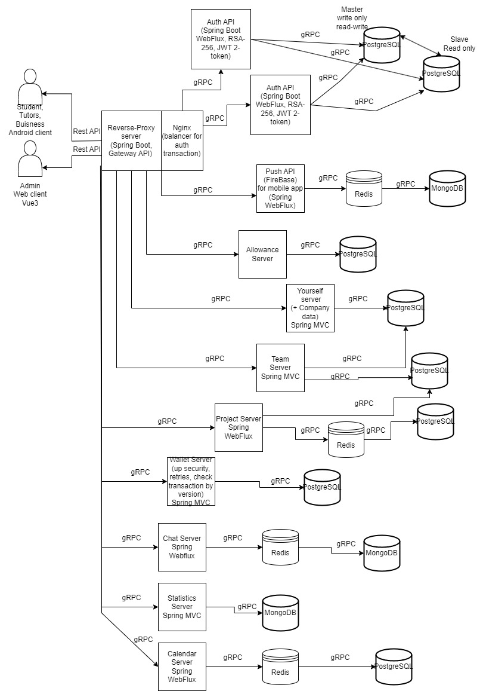

# Skillnectia

## Aggregator of scientific research/projects funded by startups and businesses

The existing technical higher education is enriched with theoretical knowledge, but is deprived of practical tasks, especially those that meet modern market requirements.
On the other hand, small businesses and startups need qualified personnel with minimal costs.
The state can act as an intermediary by offering a university site with the necessary equipment.
The social project "Skillnectia" is aimed at communicating the student community with representatives of startups and small businesses through curators from the university and small businesses.
The platform includes the following innovations:

Client-server aggregator application for 3 roles: entrepreneur, supervisor, student with different rights and functionality.
An entrepreneur registers as a company or sole proprietor, and the system verifies registration with state support (verification according to the state register). Next, he creates an application indicating the topic, the direction, the necessary equipment, the required competencies of the implementing team, the minimum remuneration that goes to the platform's account and operates under the "secure transaction" mechanism, and the opportunity to increase project financing.
A supervisor is a person attached to a specific order (from the business side) or a specific team (from the university). Functionality: preparation of work plans / completed works, messenger between the curators of one project, appointment of meetings between project participants with the inclusion of meetings in the project calendar. The curator from the university establishes the student's affiliation to the project group, has the right to edit information about the team, and submits an application for participation in the order auction. Organizes admission to the university laboratory. Sets the team-lead of the team. Sets the percentage of remuneration for their intermediary services.
Student. Functionality: team-lead distributes tasks within the team (editing by the supervisor is acceptable; team-lead distributes the percentage of remuneration; messenger between participants, viewing tasks, completed processes. The availability of a wallet for the distribution of rewards.
Chain of interactions: Sole proprietor/Firm -> Supervisor of the firm -> Supervisor of the university -> team-lead of the team -> student of the team
Related measures: creation of coworking spaces on the basis of universities - a comfortable environment for interaction

# Skillnectia

## Агрегатор научных исследований/проектов, финансируемых стартапами и бизнесом

Существующее техническое высшее образование обогащено теоретическими знаниями, но обделено практическими заданиями, в особенности отвечающих современным требованиям рынка.
А с другой стороны, малый бизнес и стартапы нуждаются в квалифицированных кадрах с минимальными издержками.
Государство может выступить посредником, предлагая площадку вузов с необходимым оборудованием.
Социальный проект "Skillnectia" направлен на коммуникацию студенческого сообщества с представителями стартапов и малого бизнеса через кураторов со стороны вуза и малого бизнеса.
Платформа подразумевает следующие нововведения:

Клиент-серверное приложение-агрегатор для 3 ролей: предприниматель, куратор, студент с различными правами и функциональностью.
Предприниматель регистрируется как фирма, или ИП, система верифицирует регистрацию с государственной поддержкой (проверка по госреестру). Далее создаёт заявку с указанием темы, направления, необходимого оборудования, требуемые компетенции команды-исполнителя, минимального вознаграждения, которое поступает на счёт платформы и работает по механизму "безопасная сделка", возможность увеличить финансирование проекта.
Куратор - человек, прикреплённый к определённому заказу (со стороны бизнеса) или определённой команде (со стороны вуза). Функциональность: составление планов работ/выполненных работ, мессенджер между кураторами одного проекта, назначение встреч между участниками проекта с внесением встречи в календарь проекта. Куратор от вуза устанавливает принадлежность студента к проектной группе, имеет право редактирования сведений о команде, подает заявку об участии в аукционе заказа. Организует получение допуска в лаборатории вуза. Устанавливает team-lead команды. Устанавливает процент за свои услуги посредника от вознаграждения.
Студент. Функциональность: team-lead распределяет задачи внутри команды (допустимо редактирование со стороны куратора; team-lead распределяет процентное соотношение вознаграждения; мессенджер между участниками, просмотр задач, выполненных процессов. Наличие кошелька для распределения вознаграждения.
Цепочка взаимодействий: ИП/Фирма -> Куратор фирмы -> Куратор вуза -> team-lead команды -> студент команды
Сопутствующие меры: создание коворкингов на базе вузов - комфортной среды для взаимодействия.

## Docs / Документы

[Questioning students - Анкетирование студентов](https://docs.google.com/forms/d/1wCE6e7VEdyboLjIvc6iqOOKh3JWnWb0mQuiq2E6TmIU/viewform?edit_requested=true)  
[Technical specification - Техническое задание (требуются исправления)](https://docs.google.com/document/d/11lUS-RxRcUltm0umOkL4HxHoISA1meo7/edit#heading=h.3znysh7)  
[Presentation text - Основной текст (требуются исправления)](https://docs.google.com/document/d/1W57lkIvKHbOWzd3Hbv87U3I-64tEX9Jw/edit)  

Макеты figma по запросу, большой объем работы, требует уточнения и дополнений  

## Technology stack / Стек технологий

### Backend system

1) Spring Boot Kotlin (Kotlin 2.0.0 +)
2) Spring Webflux + R2DBC or Spring MVC + JDBC
3) REST API + gRPC
4) PostgreSQL 17+ + MongoDB + Redis (cache/broker)
5) Firebase push messages
6) Reverse Proxy, balancer (Nginx), retries, version of transaction pattern
7) JWT Auth (2 types tokens (access/refresh))
8) Master/slave pattern
9) СI CD Jenkins (???)

Схема архитектуры приблизительная, требует уточнения и некоторой проработки (особенно в асинхронной связи между серверами)

### Admin panel

1) Vue3 + NuxtJS
2) Pinia state store

### Mobile app

1) Android SDK, API level 26 (android 8 Oreo) -> 86% of all devices
2) Ktor Client (???) or OkHttp + Retrofit
3) DI Hilt
4) Jetpack Compose UI